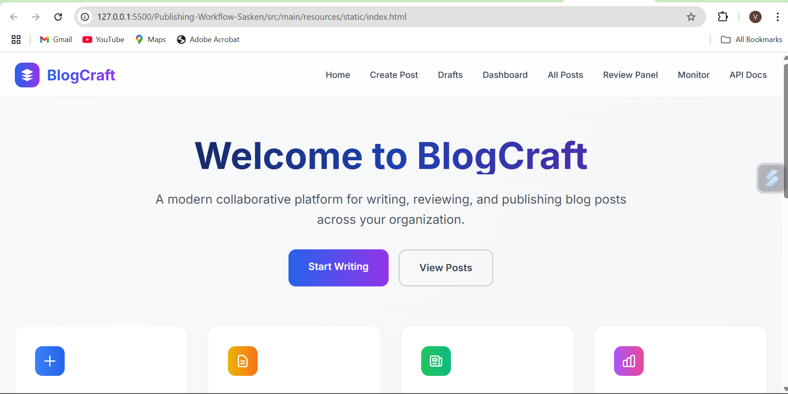
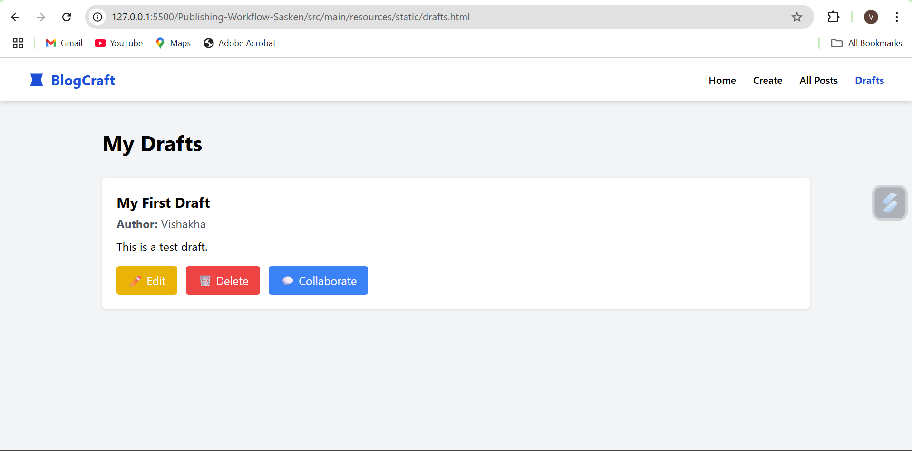
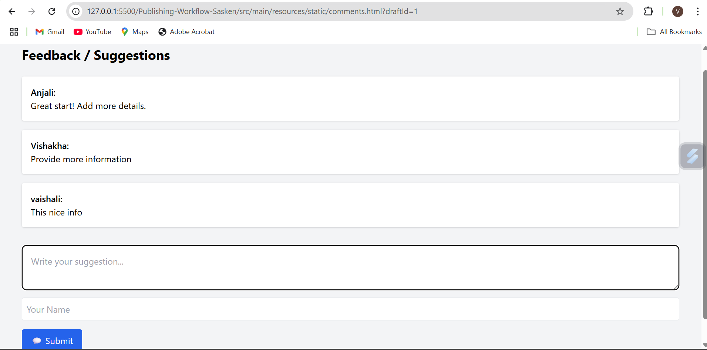
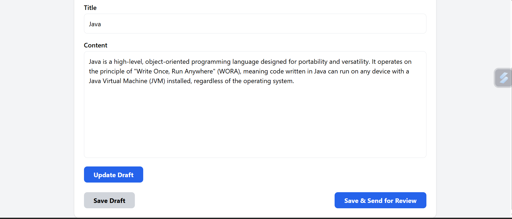

# 🤝 Collaboration-Module-Sasken (BlogCraft)

This module enables **collaborative blog drafting** within the BlogCraft platform. Built using **Spring Boot** and **MySQL**, it supports real-time co-authoring, suggestions, and commenting to enhance team-driven content creation.

---

## 🌟 Collaboration Features

🔧 **Collaboration Tools for Drafts**  
- ✏️ **Edit Draft** – Co-authors can modify existing draft content.  
- 💡 **Suggest Changes** – Team members can give suggestions before finalization.  
- 💬 **Comment System** – Users can add feedback or comments tied to a specific draft.  
- 🔄 Real-time updates reflected in the database (`drafts` and `comments` tables).

---

## 🛠️ Technologies Used

- **Backend**: Java, Spring Boot (RESTful APIs)
- **Frontend**: HTML, JavaScript, Tailwind CSS
- **Database**: MySQL + Spring Data JPA

---

## 📁 Folder Highlights

collabtool/
├── controller/
│ └── CollaborationController.java
├── model/
│ ├── Draft.java
│ └── Comment.java
├── repository/
│ ├── DraftRepository.java
│ └── CommentRepository.java
├── resources/
│ └── static/ (Frontend files like drafts.html, comments.html, JS files)
└── application.properties

---

## 💡 How It Works

- Drafts are saved by authors and viewable by collaborators.
- Collaborators can **edit** or **comment** on those drafts.
- Each comment includes a `username` and a `message`.
- Data is persisted in MySQL via Spring Boot repositories.

---

## Screenshots

## 🖼️ Screenshots

### 🧾 BlogCraft Overview

### 🤝 Collaboration Tool UI

### 💬 Comments Interface

### ✍️ Draft Creation

---

## Authors

1. Vishakha Yeole
2. Mayur Bhong
3. Mayur Aghao

